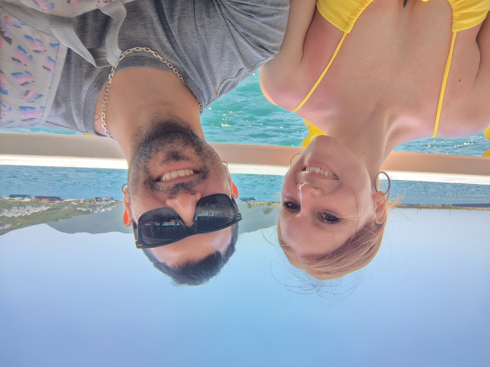

<!DOCTYPE html>
<html lang="es">
<head>
    <meta charset="UTF-8">
    <meta name="viewport" content="width=device-width, initial-scale=1.0">
    <link rel="icon" href="corazon.png" type="image/png">
    <title>Feliz San Valentín</title>
    <link href="https://cdn.jsdelivr.net/npm/bootstrap@5.3.0/dist/css/bootstrap.min.css" rel="stylesheet">
    
</head>
<body>
    <main>
    
    <button class="btn btn-danger mt-3" onclick="document.getElementById('music').play()">🎵 Reproducir música</button>
    
    <audio id="music" loop>
        <source src="Ke Personajes  Entre Beso y Beso.mp3" type="audio/mp3">
    </audio>
    
    <!-- Carrusel de Fotos -->
    

        

            

                
            

            

                
            

            

                
            

            

                
            

        

        <a class="carousel-control-prev" href="#carouselExample" role="button" data-bs-slide="prev">
            
            Anterior
        </a>
        <a class="carousel-control-next" href="#carouselExample" role="button" data-bs-slide="next">
            
            Siguiente
        </a>
    

    
    <!-- Sobres interactivos -->
    

        
        
        
        
        
        
    

    
    

        

        

        

        
<video controls><source src="VID_20241126_234611497~3.mp4" type="video/mp4"></video>

        

Que decirte que no sepas poolita, muchas gracias por estar a mi lado, gracias por siempre acompañarme en esta vida, por la hermosa familia que formamos juntos y ser mi compañera tanto en las buenas como en las malas(que fueron mayoria jajajaja)❤️

        

Ya lo dije una vez, pero quiero estar con vos la vida entera, aun nose porque elejiste estar conmigo, porque mucho no tenia para ofrecer, pero aunque nunca lo dije me comprometi a convertirme en un gran hombre, uno del que puedas estar orgullosa, un hombre que pueda darte todo lo que mereces y mucho mas, si algo tiene este mundo ese algo yo lo voy a tomar para regalartelo, y si hoy te pido que seas mi esposa es porque creo que lo estoy logrando ❤️

    

    
    

    
    
    
    
</main>
        <!-- Footer -->
    <footer class="footer mt-5 pt-4 pb-4">
        

            
❤️ ¡Gracias por visitar Pooli! ❤️

            
Creado con amor San Valentín de mi parte Gabrielito.

        

    </footer>
</body>
</html>
